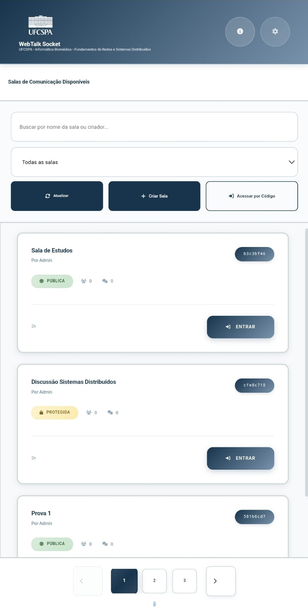
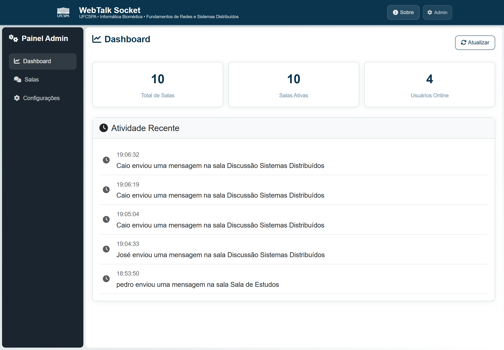

<p align="center">
  
</p>

<h1 align="center">WebTalk Socket</h1>

<p align="center">
  <em>Sistema de comunicação em tempo real baseado em WebSockets para a disciplina de Redes de Computadores e Sistemas Distribuídos da UFCSPA.</em>
</p>

---

<p align="center">
  
  <br>
  <strong>Tela Inicial (Desktop)</strong>
</p>

<p align="center">
  
  <br>
  <strong>Tela Inicial (Mobile)</strong>
</p>

<p align="center">
  
  <br>
  <strong>Painel Administrativo (Desktop)</strong>
</p>

## Funcionalidades

- **Chat em Tempo Real** - Mensagens instantâneas com comunicação WebSocket
- **Compartilhamento de Arquivos** - Upload e compartilhamento de imagens/PDFs (até 16MB)
- **Gerenciamento de Salas** - Criação de salas públicas/privadas com IDs únicos
- **Painel Administrativo** - Monitoramento de salas ativas e estatísticas do sistema
- **Design Responsivo** - Funciona em dispositivos desktop e mobile

## Tecnologias

- **Backend:** Python, Flask, Flask-SocketIO, SQLite
- **Frontend:** HTML5, CSS3, JavaScript, Bootstrap 5
- **Protocolos:** HTTP/REST, WebSocket, JSON

## Arquitetura e Funcionamento

### Visão Geral do Sistema

O WebTalk Socket implementa uma arquitetura cliente-servidor distribuída que combina **REST APIs** para operações CRUD e **WebSocket** para comunicação em tempo real. O sistema integra Flask (HTTP) e Flask-SocketIO (WebSocket) em um único processo, compartilhando a mesma porta e garantindo sincronização eficiente.

### 1. Inicialização e Fluxo de Acesso

**Startup do Sistema:**
- O `app.py` inicializa simultaneamente o servidor Flask e Socket.IO
- Flask serve páginas HTML e APIs REST
- Socket.IO gerencia comunicação WebSocket em tempo real

**Fluxo de Usuário:**
1. **Acesso inicial:** Usuário acessa `/` → Flask renderiza `index.html` → Carrega `main.js`
2. **Listagem de salas:** JavaScript executa `fetch('/api/salas')` → Backend retorna salas ativas em JSON
3. **Interface responsiva:** Exibição em tabela (desktop) ou cards (mobile) com paginação dinâmica

### 2. Gerenciamento de Salas (CRUD)

**Criação de Sala:**
```
POST /api/salas → Validação → Persistência SQLite → Retorno do ID único
```

**Acesso a Sala:**
```
POST /api/salas/{id}/entrar → Validação de senha → Autorização → Redirecionamento
```

**Validação de Segurança:**
- Salas protegidas por senha opcional
- Validação de entrada antes do acesso ao chat
- IDs únicos de 8 caracteres para cada sala

### 3. Comunicação em Tempo Real (WebSocket)

**Estabelecimento de Conexão:**
```javascript
// Cliente conecta via Socket.IO
socket = io();
socket.emit('entrar', {id_sala: roomId, username: username});
```

**Eventos WebSocket Principais:**
- `entrar` - Adiciona usuário à sala, envia histórico de mensagens
- `mensagem_chat` - Recebe, persiste e distribui mensagens instantaneamente
- `arquivo_compartilhado` - Notifica todos sobre novos arquivos
- `deletar_mensagem` - Executa soft delete e sincroniza remoção

**Sincronização em Tempo Real:**
- Mensagens aparecem instantaneamente para todos os usuários
- Notificações de entrada/saída de usuários
- Atualizações de interface sem reload da página

### 4. Sistema de Arquivos

**Upload de Arquivos:**
```
FormData → POST /api/salas/{id}/upload → Validação → Persistência → Notificação WebSocket
```

**Características:**
- Suporte a imagens e PDFs (até 16MB)
- Organização em subpastas por sala (`uploads/sala_id/`)
- Validação de tipo e tamanho no backend
- Download direto via HTTP GET

**Fluxo de Compartilhamento:**
1. Upload via HTTP → Validação → Salvamento
2. Registro no banco de dados
3. Notificação em tempo real via WebSocket
4. Atualização automática da interface

### 5. Soft Delete e Integridade

**Remoção de Mensagens:**
- Usuários podem deletar apenas suas próprias mensagens
- Soft delete: marca como `tipo = 'deletada'` sem remoção física
- Substitui conteúdo por "Mensagem deletada" ou "Arquivo deletado"
- Sincronização instantânea via WebSocket

### 6. Arquitetura do Banco de Dados

**Estrutura SQLite:**

**Tabela `salas`:**
- `id` (TEXT, PK) - Identificador único (8 caracteres)
- `nome` (TEXT) - Nome da sala
- `criador` (TEXT) - Nome do criador
- `senha` (TEXT) - Senha opcional
- `criado_em` (TEXT) - Timestamp de criação
- `esta_ativa` (INTEGER) - Status ativo/inativo

**Tabela `mensagens`:**
- `id` (TEXT, PK) - Identificador único
- `id_sala` (TEXT, FK) - Referência à sala
- `nome_usuario` (TEXT) - Autor da mensagem
- `conteudo` (TEXT) - Texto ou descrição do arquivo
- `tipo` (TEXT) - 'texto', 'arquivo' ou 'deletada'
- `nome_arquivo` (TEXT) - Nome do arquivo (se aplicável)
- `caminho_arquivo` (TEXT) - Caminho físico
- `tipo_arquivo` (TEXT) - MIME type
- `horario` (TEXT) - Timestamp

**Integridade e Concorrência:**
- Operações críticas protegidas por locks
- Validação de integridade referencial
- Suporte a operações concorrentes

### 7. Painel Administrativo

**Monitoramento em Tempo Real:**
- Estatísticas do sistema via `/api/admin/estatisticas`
- Gerenciamento de salas ativas
- Remoção administrativa de salas
- Interface AJAX para operações sem reload

### Conceitos Técnicos Demonstrados

- **Sistemas Distribuídos:** Arquitetura cliente-servidor escalável
- **Protocolos de Rede:** HTTP/REST + WebSocket para diferentes necessidades
- **Persistência:** SQLite com design relacional otimizado
- **Tempo Real:** Sincronização instantânea via Socket.IO
- **Segurança:** Validação de uploads, autenticação por senha
- **Responsividade:** Design adaptativo mobile-first
- **Concorrência:** Gerenciamento de estado distribuído thread-safe

### Fluxo de Dados Integrado

```
Usuário → Frontend (HTML/JS) → 
├── REST API (Flask) → SQLite → Resposta HTTP
└── WebSocket (Socket.IO) → Event Broadcasting → Todos os Clientes
```

Esta arquitetura híbrida permite aproveitar o melhor dos dois protocolos: **REST para operações estruturadas** e **WebSocket para interatividade em tempo real**.

## Início Rápido

### Pré-requisitos
- Python 3.8+
- pip

### Instalação

1. Clone o repositório
```bash
git clone <repository-url>
cd webtalk-socket
```

2. Instale as dependências
```bash
pip install flask flask-socketio
```

3. Execute a aplicação
```bash
python app.py
```

4. Acesse o sistema
- Interface principal: http://localhost:5000
- Painel administrativo: http://localhost:5000/admin (senha: `admin123`)

## Estrutura do Projeto

```
webtalk-socker/
├── app.py                 # Aplicação principal
├── config.py              # Configurações
├── limpar_banco.py        # Script de manutenção do banco
├── models/room.py         # Modelo de gerenciamento de salas
├── routes/                # Endpoints da API
├── socketio_handlers/     # Manipuladores de eventos WebSocket
├── static/                # CSS, JS, imagens
├── templates/             # Templates HTML
└── uploads/               # Diretório de arquivos compartilhados
```

## APIs e Endpoints

### Gerenciamento de Salas
- `GET /api/salas` - Lista salas ativas
- `POST /api/salas` - Cria nova sala
- `POST /api/salas/{id}/entrar` - Valida acesso à sala

### Compartilhamento de Arquivos
- `POST /api/salas/{id}/upload` - Upload de arquivo
- `GET /api/salas/{id}/download/{arquivo}` - Download de arquivo
- `DELETE /api/salas/{id}/mensagens/{msg_id}` - Remove mensagem/arquivo

### Administração
- `GET /api/admin/estatisticas` - Estatísticas do sistema
- `DELETE /api/admin/salas/{id}` - Remove sala (admin)

## Eventos WebSocket

- `entrar` - Entrar na sala
- `mensagem_chat` - Enviar mensagem
- `arquivo_compartilhado` - Compartilhar arquivo
- `deletar_mensagem` - Deletar mensagem própria

## Script de Manutenção

Execute o script para gerenciar o banco de dados:

```bash
python limpar_banco.py
```

**Opções disponíveis:**
- Limpeza completa do banco e arquivos
- Limpeza apenas dos dados (preserva estrutura)
- Remoção de arquivos órfãos
- Verificação de integridade

## Contexto Acadêmico

**Universidade:** Universidade Federal de Ciências da Saúde de Porto Alegre (UFCSPA)  
**Curso:** Bacharelado em Informática Biomédica  
**Disciplina:** Fundamentos de Redes de Computador e Sistemas Distribuídos  
**Professor:** João Carlos Gluz

**Equipe:**
- [Bruno Costa E Silva Giuliani Lopes](https://www.linkedin.com/in/bruno-costa-e-silva-giuliani-lopes-955828282/)
- [Caio Foti Pontes](https://www.linkedin.com/in/caiofoti/)
- [Tainá Machado Selayaran](https://www.linkedin.com/in/taina-selayaran/)

## Licença

Projeto acadêmico - Para fins educacionais apenas.
