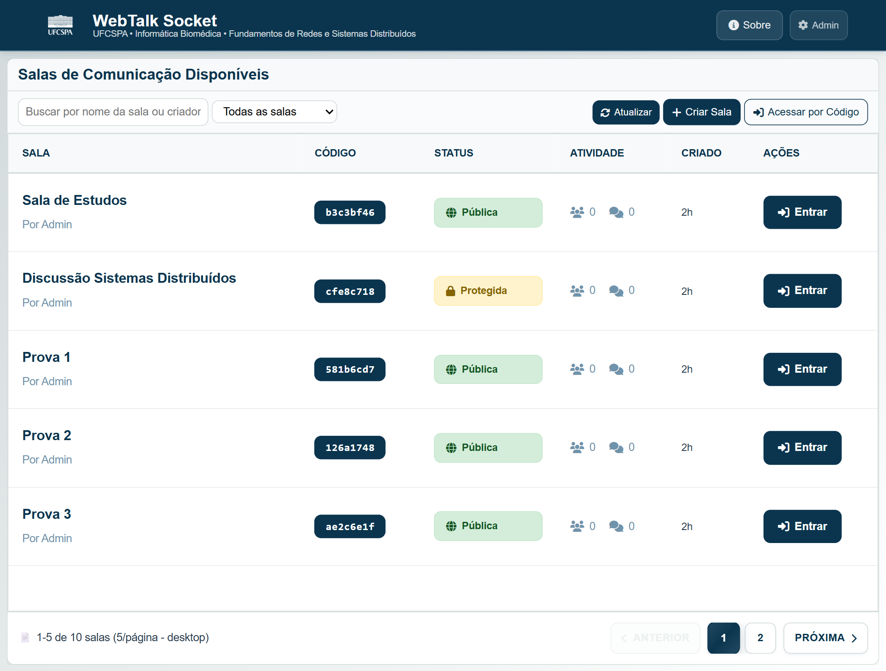
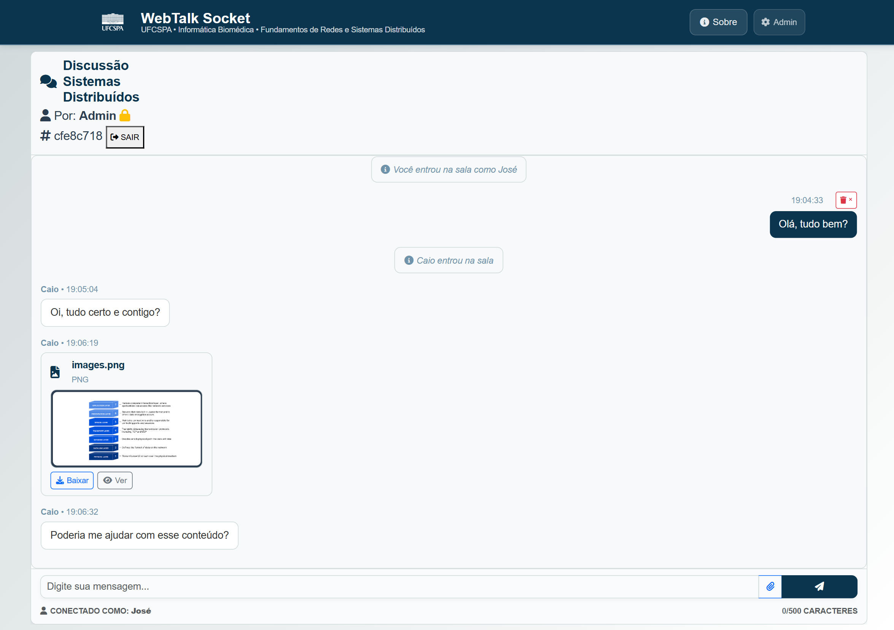

# WebTalk Socket

<div style="display:flex; justify-content:center; gap:20px; margin-bottom:20px;">
  <div style="flex:1; max-width:400px;">
    
    <p style="text-align:center; font-size:0.9em; margin-top:6px;">Tela Inicial Desktop</p>
  </div>
  <div style="flex:1; max-width:400px;">
    
    <p style="text-align:center; font-size:0.9em; margin-top:6px;">Tela Chat Desktop</p>
  </div>
</div>

Sistema de comunicação em tempo real baseado em WebSockets para a disciplina de Redes e Sistemas Distribuídos da UFCSPA.

## Funcionalidades

- **Chat em Tempo Real** - Mensagens instantâneas com comunicação WebSocket
- **Compartilhamento de Arquivos** - Upload e compartilhamento de imagens/PDFs (até 16MB)
- **Gerenciamento de Salas** - Criação de salas públicas/privadas com IDs únicos
- **Painel Administrativo** - Monitoramento de salas ativas e estatísticas do sistema
- **Design Responsivo** - Funciona em dispositivos desktop e mobile

## Tecnologias

- **Backend:** Python, Flask, Flask-SocketIO, SQLite
- **Frontend:** HTML5, CSS3, JavaScript, Bootstrap 5
- **Protocolos:** HTTP/REST, WebSocket, JSON

## Início Rápido

### Pré-requisitos
- Python 3.8+
- pip

### Instalação

1. Clone o repositório
```bash
git clone <repository-url>
cd webtalk-socket
```

2. Instale as dependências
```bash
pip install flask flask-socketio
```

3. Execute a aplicação
```bash
python app.py
```

4. Acesse o sistema
- Interface principal: http://localhost:5000
- Painel administrativo: http://localhost:5000/admin (senha: `admin123`)

## Estrutura do Projeto

```
webtalk-socker/
├── app.py                 # Aplicação principal
├── config.py              # Configurações
├── limpar_banco.py        # Script de manutenção do banco
├── models/room.py         # Modelo de gerenciamento de salas
├── routes/                # Endpoints da API
├── socketio_handlers/     # Manipuladores de eventos WebSocket
├── static/                # CSS, JS, imagens
├── templates/             # Templates HTML
└── uploads/               # Diretório de arquivos compartilhados
```

## APIs e Endpoints

### Gerenciamento de Salas
- `GET /api/salas` - Lista salas ativas
- `POST /api/salas` - Cria nova sala
- `POST /api/salas/{id}/entrar` - Valida acesso à sala

### Compartilhamento de Arquivos
- `POST /api/salas/{id}/upload` - Upload de arquivo
- `GET /api/salas/{id}/download/{arquivo}` - Download de arquivo
- `DELETE /api/salas/{id}/mensagens/{msg_id}` - Remove mensagem/arquivo

### Administração
- `GET /api/admin/estatisticas` - Estatísticas do sistema
- `DELETE /api/admin/salas/{id}` - Remove sala (admin)

## Eventos WebSocket

- `entrar` - Entrar na sala
- `mensagem_chat` - Enviar mensagem
- `arquivo_compartilhado` - Compartilhar arquivo
- `deletar_mensagem` - Deletar mensagem própria

## Script de Manutenção

Execute o script para gerenciar o banco de dados:

```bash
python limpar_banco.py
```

**Opções disponíveis:**
- Limpeza completa do banco e arquivos
- Limpeza apenas dos dados (preserva estrutura)
- Remoção de arquivos órfãos
- Verificação de integridade

## Contexto Acadêmico

**Universidade:** Universidade Federal de Ciências da Saúde de Porto Alegre (UFCSPA)  
**Curso:** Bacharelado em Informática Biomédica  
**Disciplina:** Fundamentos de Redes e Sistemas Distribuídos  
**Professor:** João Carlos Gluz

**Equipe:**
- [Bruno Costa E Silva Giuliani Lopes](https://www.linkedin.com/in/bruno-costa-e-silva-giuliani-lopes-955828282/)
- [Caio Foti Pontes](https://www.linkedin.com/in/caiofoti/)
- [Tainá Machado Selayaran](https://www.linkedin.com/in/taina-selayaran/)

## Licença

Projeto acadêmico - Para fins educacionais apenas.